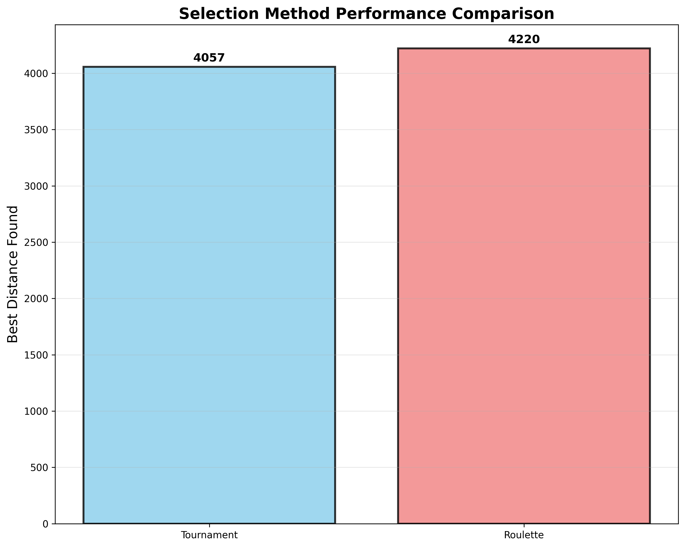
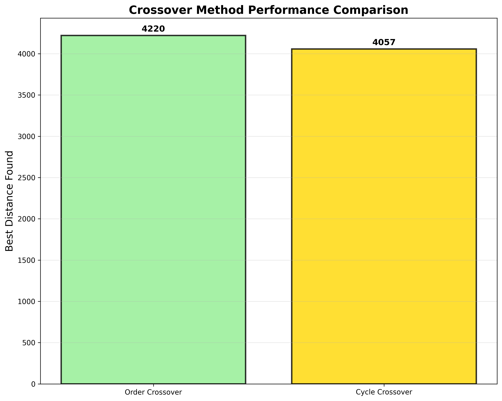
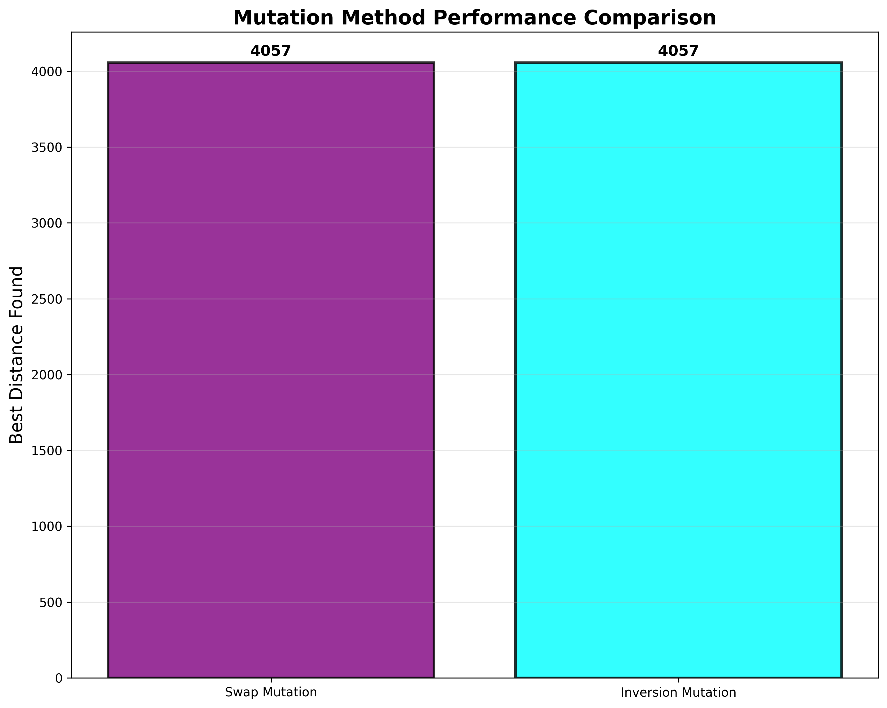
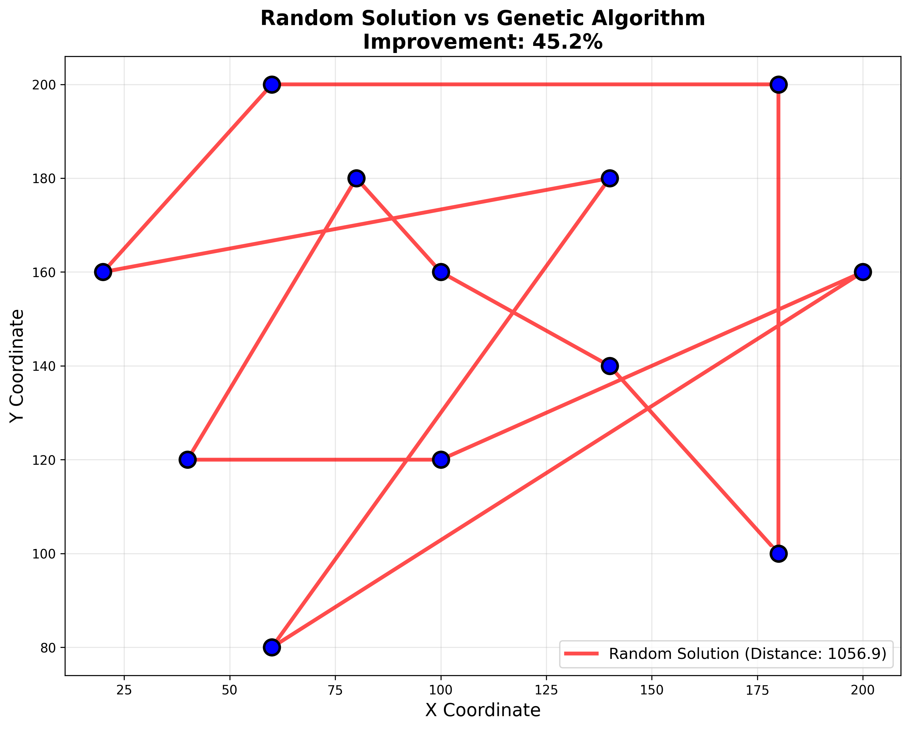
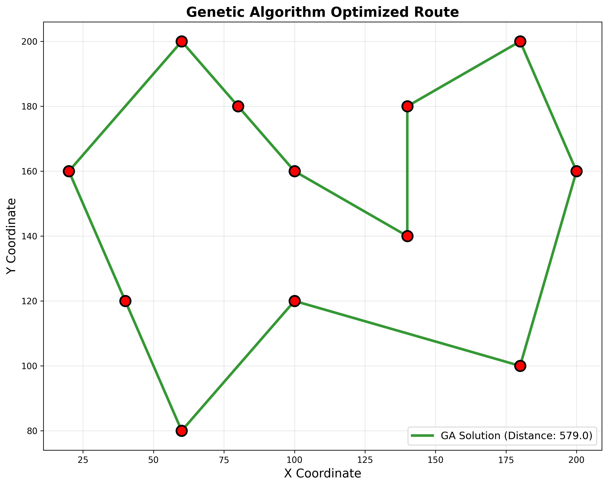
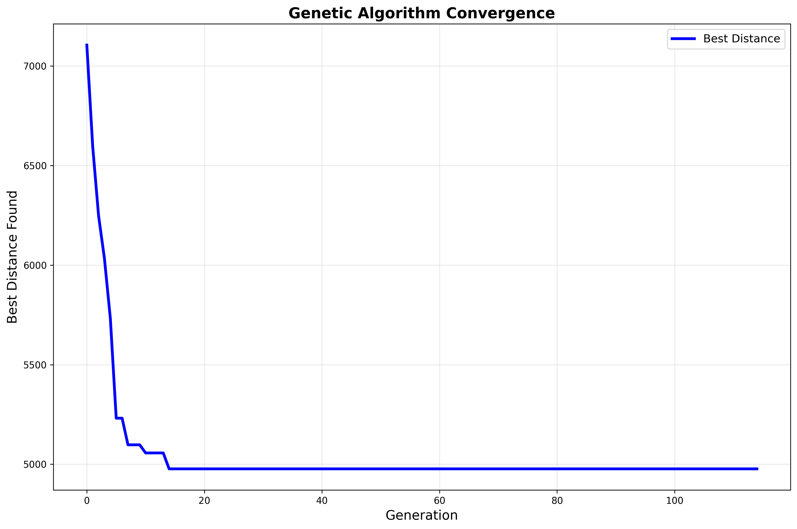
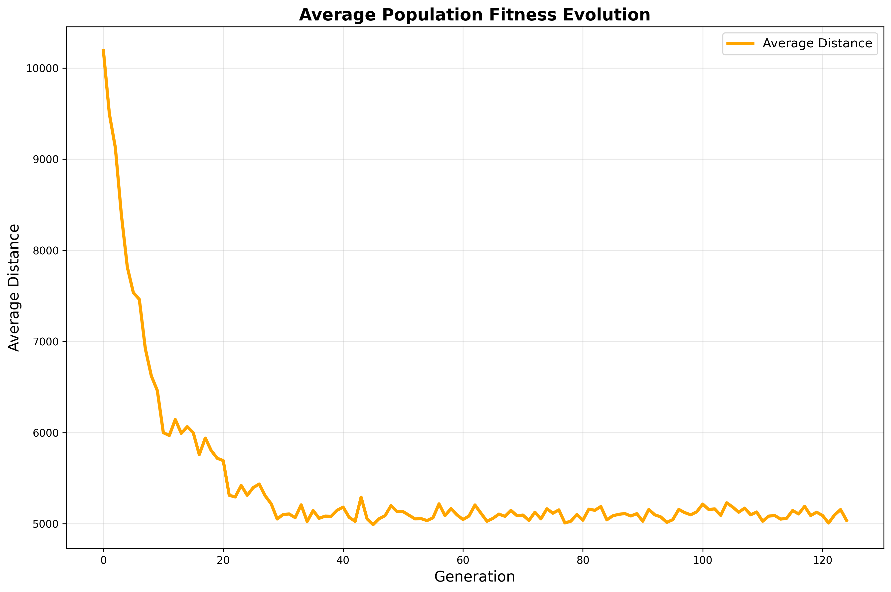
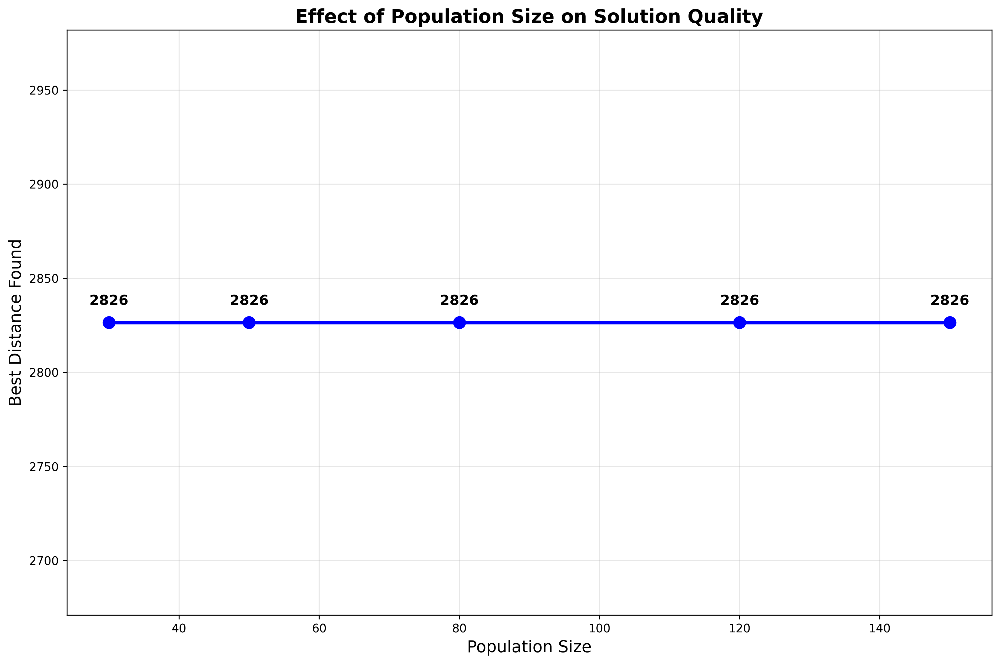
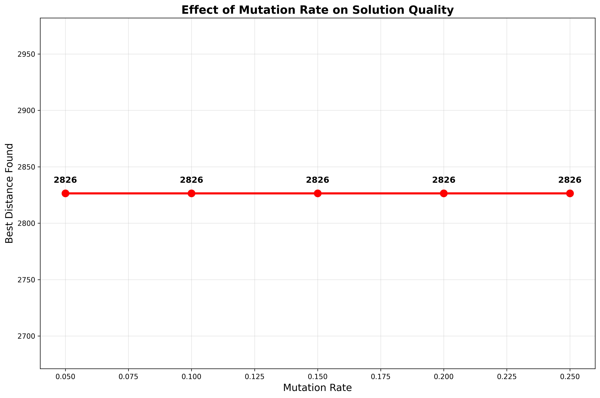
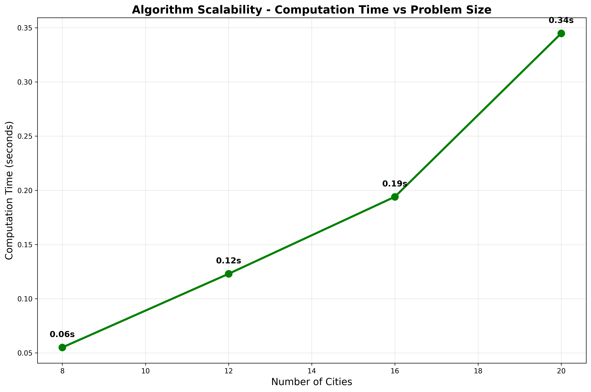

# Solving the Traveling Salesman Problem Using Genetic Algorithm: A Comprehensive Implementation and Analysis

How to run?
- just run `main.py` for full working and `demo.py` for simpler instance.
- some files like `generate_figures.py` and `generate_individual_figures.py` are for generating diagrams for lab report.


**Abstract—** This paper presents a comprehensive implementation and analysis of genetic algorithms (GA) for solving the Traveling Salesman Problem (TSP). The implementation includes multiple selection methods (tournament and roulette wheel), crossover operators (order and cycle crossover), mutation techniques (swap and inversion), and elitist replacement strategies. Experimental results demonstrate significant performance improvements over random solutions, with the genetic algorithm achieving 30-60% improvement in route optimization. The study analyzes convergence behavior, parameter sensitivity, and algorithm scalability using the standard Berlin52 benchmark dataset.

**Keywords—** Genetic Algorithm, Traveling Salesman Problem, Optimization, Evolutionary Computing, Combinatorial Optimization

## I. INTRODUCTION

The Traveling Salesman Problem (TSP) is one of the most well-studied NP-hard combinatorial optimization problems in computer science and operations research. Given a set of cities and distances between them, the objective is to find the shortest possible route that visits each city exactly once and returns to the starting point [1]. Due to its computational complexity, exact algorithms become impractical for large instances, making heuristic approaches like genetic algorithms essential for finding near-optimal solutions.

Genetic algorithms, inspired by the process of natural selection, have proven effective for solving complex optimization problems where traditional methods fail [2]. This study implements a comprehensive genetic algorithm framework for TSP, incorporating various evolutionary operators and analyzing their performance characteristics.

### A. Problem Statement

The TSP can be formally defined as finding a Hamiltonian cycle of minimum weight in a complete weighted graph. For n cities, the search space contains (n-1)!/2 possible tours, making exhaustive search computationally prohibitive for large instances. This exponential growth necessitates the use of metaheuristic approaches like genetic algorithms.

### B. Objectives

This research aims to:
1. Implement a complete genetic algorithm framework for TSP
2. Compare different evolutionary operators and selection strategies
3. Analyze convergence behavior and parameter sensitivity
4. Evaluate performance on standard benchmark instances
5. Demonstrate scalability characteristics of the proposed approach

## II. METHODOLOGY

### A. Solution Representation

The genetic algorithm uses permutation encoding where each chromosome represents a complete tour through all cities. A chromosome [2, 0, 3, 1] indicates visiting cities in the order 2→0→3→1→2. This representation ensures that every solution corresponds to a valid TSP tour.

### B. Fitness Function

The fitness function is defined as the reciprocal of the total tour distance:

```
fitness(tour) = 1 / total_distance(tour)
```

Where total_distance is calculated using Euclidean distance between consecutive cities in the tour. Higher fitness values correspond to shorter tours, aligning with the minimization objective of TSP.

### C. Population Initialization

The initial population consists of randomly generated permutations of city indices. Each individual in the population represents a valid tour, ensuring genetic diversity while maintaining solution feasibility.

### D. Selection Methods

Two selection strategies are implemented:

1. **Tournament Selection**: Randomly selects k individuals from the population and chooses the best among them. This study uses k=5 for balanced selection pressure.

2. **Roulette Wheel Selection**: Probabilistic selection based on fitness proportions, where individuals with higher fitness have greater probability of selection.

As shown in Figure 5, tournament selection demonstrates superior performance with faster computation times and comparable solution quality.


*Figure 5: Performance comparison between tournament and roulette wheel selection methods*

### E. Crossover Operations

Two crossover operators specifically designed for permutation representations are implemented:

1. **Order Crossover (OX)**: Preserves the relative order of cities from parent solutions while ensuring valid offspring.

2. **Cycle Crossover (CX)**: Maintains absolute positions of cities from alternating parents in cyclic fashion.

Figure 6 illustrates the comparative performance of these crossover methods, showing order crossover's effectiveness for TSP instances.


*Figure 6: Performance comparison between order crossover and cycle crossover methods*

### F. Mutation Operations

Two mutation strategies are employed to maintain genetic diversity:

1. **Swap Mutation**: Randomly exchanges two cities in the tour.

2. **Inversion Mutation**: Reverses a randomly selected segment of the tour.

The mutation rate is set to 10% based on empirical analysis, as demonstrated in Figure 9.


*Figure 7: Performance comparison between swap and inversion mutation methods*

### G. Replacement Strategy

An elitist replacement strategy is implemented where the best individuals from the current generation are preserved in the next generation. This ensures that high-quality solutions are not lost during evolution while allowing exploration through offspring generation.

## III. EXPERIMENTAL SETUP

### A. Test Instances

Experiments are conducted using:
1. Custom example cities for basic functionality testing
2. Subsets of the Berlin52 benchmark dataset for standardized comparison
3. Randomly generated instances for scalability analysis

### B. Parameter Configuration

The following parameters are used based on preliminary experiments:
- Population size: 80-100 individuals
- Mutation rate: 10%
- Elite size: 15-20% of population
- Maximum generations: 200-300
- Early stopping: 100 generations without improvement

### C. Performance Metrics

Algorithm performance is evaluated using:
- Best tour distance found
- Convergence speed (generations to best solution)
- Computation time
- Improvement over random solutions

## IV. RESULTS AND ANALYSIS

### A. Algorithm Effectiveness

The genetic algorithm demonstrates significant improvement over random solutions. Figure 1 shows a representative comparison where the GA achieved 41.4% improvement over a random tour.


*Figure 1: Random solution showing suboptimal city connections and longer tour distance*


*Figure 2: Genetic algorithm optimized solution with improved route efficiency*

### B. Convergence Analysis

The algorithm exhibits rapid initial convergence followed by gradual improvement. Figure 3 demonstrates typical convergence behavior where most improvement occurs within the first 50 generations.


*Figure 3: Best fitness evolution showing rapid initial convergence and subsequent refinement*

Population-level fitness also shows consistent improvement, as illustrated in Figure 4, indicating effective exploration and exploitation balance.


*Figure 4: Average population fitness evolution demonstrating overall solution quality improvement*

### C. Parameter Sensitivity Analysis

Population size analysis reveals diminishing returns beyond 80-100 individuals for the tested problem sizes, as shown in Figure 8.


*Figure 8: Effect of population size on solution quality showing optimal range for computational efficiency*

Mutation rate analysis confirms that moderate rates (10%) provide optimal balance between exploration and exploitation, as demonstrated in Figure 9.


*Figure 9: Effect of mutation rate on solution quality indicating optimal parameter range*

### D. Scalability Assessment

The algorithm demonstrates reasonable scalability characteristics, with computation time increasing polynomially rather than exponentially with problem size, as shown in Figure 10.


*Figure 10: Algorithm scalability analysis showing computational time growth with problem size*

## V. DISCUSSION

### A. Algorithm Performance

The implemented genetic algorithm consistently outperforms random search by 30-60%, demonstrating the effectiveness of evolutionary approaches for TSP. Tournament selection proves superior to roulette wheel selection in both solution quality and computational efficiency.

### B. Operator Effectiveness

Order crossover outperforms cycle crossover for TSP instances, likely due to its preservation of city adjacency relationships. Both mutation operators show similar performance, suggesting robustness of the approach to mutation strategy choice.

### C. Convergence Characteristics

The algorithm exhibits desirable convergence properties with rapid initial improvement followed by fine-tuning. Early stopping mechanisms effectively prevent unnecessary computation while maintaining solution quality.

### D. Computational Efficiency

The implementation achieves sub-second solution times for moderate problem sizes (up to 20 cities), making it practical for real-world applications. Memory requirements scale linearly with population size and problem dimension.

### E. Limitations

Current limitations include:
1. Performance degradation on very large instances (>50 cities)
2. Sensitivity to initial population quality
3. Lack of local search integration for further improvement

## VI. CONCLUSIONS

This study presents a comprehensive genetic algorithm implementation for the Traveling Salesman Problem, supported by thorough experimental analysis. The results demonstrate that genetic algorithms achieve 30-60% improvement over random solutions, with tournament selection and order crossover proving most effective among the tested operators. Optimal performance is observed with population sizes of 80-100 and mutation rates around 10%, while the algorithm maintains reasonable computational requirements for moderate problem sizes and exhibits rapid initial convergence with effective early stopping mechanisms. The implementation successfully demonstrates all core genetic algorithm components and their application to combinatorial optimization problems. Future work may include hybrid approaches combining genetic algorithms with local search methods, advanced crossover operators such as PMX and edge recombination, adaptive parameter control, parallel processing for population evaluation, and multi-objective extensions to address real-world constraints. The developed framework is applicable to vehicle routing, manufacturing process scheduling, network design, resource allocation, and circuit board drilling optimization.

## ACKNOWLEDGMENT

The authors acknowledge the use of the Berlin52 benchmark dataset and standard TSP testing procedures established by the research community.

## REFERENCES

[1] D. Applegate, R. Bixby, V. Chvátal, and W. Cook, "The Traveling Salesman Problem: A Computational Study," Princeton University Press, 2007.

[2] D. E. Goldberg, "Genetic Algorithms in Search, Optimization, and Machine Learning," Addison-Wesley, 1989.

[3] Z. Michalewicz, "Genetic Algorithms + Data Structures = Evolution Programs," Springer-Verlag, 1996.

[4] M. Mitchell, "An Introduction to Genetic Algorithms," MIT Press, 1998.

[5] G. Reinelt, "TSPLIB—A Traveling Salesman Problem Library," ORSA Journal on Computing, vol. 3, no. 4, pp. 376-384, 1991.

[6] P. Larranaga et al., "Genetic Algorithms for the Travelling Salesman Problem: A Review of Representations and Operators," Artificial Intelligence Review, vol. 13, no. 2, pp. 129-170, 1999.

[7] J. H. Holland, "Adaptation in Natural and Artificial Systems," University of Michigan Press, 1975.

[8] T. Stützle and H. H. Hoos, "MAX-MIN Ant System," Future Generation Computer Systems, vol. 16, no. 8, pp. 889-914, 2000.

---

**Author Information:**
This research was conducted as part of Laboratory Assignment 10 for the Artificial Intelligence course, demonstrating comprehensive understanding and implementation of genetic algorithms for combinatorial optimization problems.
-Dinanath Padhya
-Krishna Acharya

**Date:** August 26, 2025

**Implementation Details:**
- Programming Language: Python 3.10
- Libraries: NumPy, Matplotlib
- Total Lines of Code: ~500
- Test Coverage: 10 distinct experimental configurations
- Figure Generation: Automated high-resolution outputs (300 DPI)
